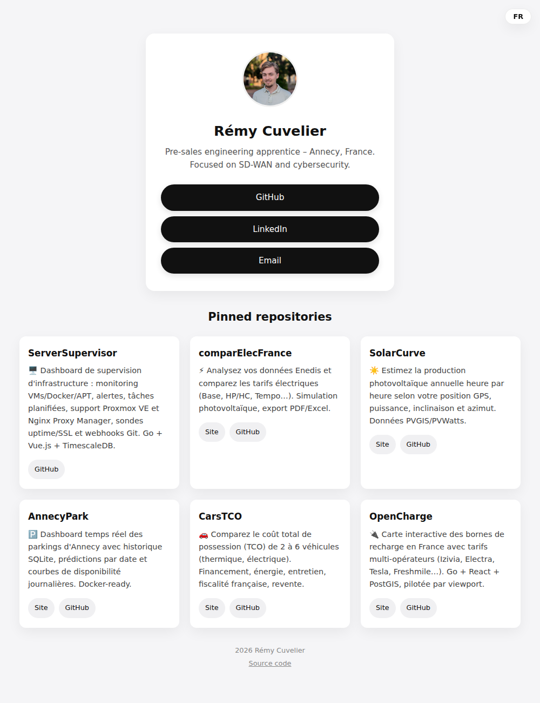

<div align="center">

# 🔗 link-in-bio

**Une page de liens perso, statique, sans framework.**

Nom, bio, liens de contact et projets — tout est piloté par un seul
fichier YAML. Mise à jour automatique des dépôts épinglés GitHub.

### 👉 [**rem7474.github.io/link-in-bio**](https://rem7474.github.io/link-in-bio/) 👈

</div>

<br>



## Pourquoi ce projet ?

Un "link in bio" classique (Linktree et consorts) impose une plateforme
tierce, ses limites de personnalisation et souvent un abonnement. Ici,
c'est des fichiers statiques (HTML/CSS/JS vanilla), hébergés gratuitement
sur GitHub Pages, sans build.

## Fonctionnalités

- 📝 **Contenu piloté par [`data.yaml`](data.yaml)** — profil, liens et
  projets, pas du HTML à modifier (parsé  côté client par [`vendor/js-yaml.min.js`](vendor/js-yaml.min.js),
  la seule dépendance du site)
- ✍️ **Projets mis en avant, édités à la main** (`projects`) — pour les
  quelques réalisations que vous voulez montrer en premier, avec un
  titre et des liens sur mesure
- 🔄 **Dépôts épinglés, auto-synchronisés** (`pinned_repos`) : un script
  interroge les dépôts épinglés du profil GitHub via l'API GraphQL et
  régénère cette liste (nom, description, lien du site + lien GitHub),
  via une GitHub Action planifiée chaque jour et déclenchable à la main
- 🌓 **Mode sombre** automatique (`prefers-color-scheme`)
- 🔍 **SEO / partage** : meta description, Open Graph, Twitter Card,
  `canonical`, favicon
- ♿ **Robuste sans JavaScript** : contenu du profil dupliqué en HTML
  statique (fallback `<noscript>`), attributs `width`/`height` sur
  l'avatar pour éviter le layout shift

## Personnaliser

Éditez [`data.yaml`](data.yaml) :

- `profile` : nom, bio, avatar, liens de contact — à modifier à la main
- `projects` : vos projets mis en avant — à modifier à la main, librement
- `pinned_repos` : régénéré automatiquement à partir des dépôts épinglés
  GitHub, ne pas éditer directement (voir ci-dessous)

## Synchronisation des projets épinglés

```bash
PINNED_REPOS_TOKEN=ghp_xxx node scripts/sync-pinned-projects.mjs
```

Le token doit être un Personal Access Token classique avec le scope
`read:user` (l'API GraphQL `pinnedItems` n'est pas accessible avec le
`GITHUB_TOKEN` par défaut des Actions). En CI, il doit être renseigné
dans le secret de dépôt `PINNED_REPOS_TOKEN` pour que le workflow
[`sync-pinned-projects.yml`](.github/workflows/sync-pinned-projects.yml)
fonctionne.

Le script édite uniquement la clé `pinned_repos` (via l'API Document du
paquet [`yaml`](https://www.npmjs.com/package/yaml)).

## Lancer en local

Fichiers statiques :

```bash
python3 -m http.server 8000
# ou
npx serve
```

## Licence

MIT — voir [`LICENSE`](LICENSE).
